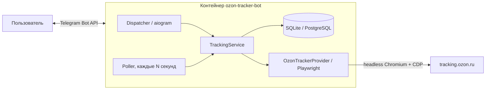

# 📦 Ozon Tracker — Telegram Shipment Tracker

<div align="center">

[](https://www.python.org/)
[](https://docs.aiogram.dev/)
[](https://playwright.dev/python/)
[](https://www.sqlalchemy.org/)
[](https://docs.docker.com/compose/)

**Асинхронный Telegram-бот, который хранит ваши отправления Ozon, автоматически
проходит антибот-челлендж официальной страницы Ozon Track и присылает
уведомление при каждой смене статуса — от «Создан» до «Получен».**

[Ключевые особенности](#-ключевые-особенности) • [Как работает](#-как-работает-проверка-статуса) • [Архитектура](#-архитектура) • [Быстрый старт](#-быстрый-старт) • [Переменные окружения](#-переменные-окружения) • [Команды бота](#-команды-бота) • [Безопасность](#-безопасность-и-приватность) • [Разработка](#-разработка)

</div>

---

## 📖 Overview

`Ozon Tracker` — self-hosted бот для отслеживания посылок Ozon. Он не требует
авторизации в аккаунте Ozon и не использует приватные API: статусы читаются с
официальной публичной страницы [Ozon Track](https://tracking.ozon.ru/) через
headless-браузер. Всё, что нужно боту, — токен от [@BotFather](https://t.me/BotFather)
и список Telegram-username, которым разрешён доступ.

### 🌟 Ключевые особенности:

- 🛡️ **Автопрохождение антибот-челленджа Ozon**:
  - страница Track начинается с `HTTP 403` и JS-челленджа (`Antibot Challenge Page`);
  - бот представляется настольным Google Chrome через CDP-переопределение
    client hints (`Network.setUserAgentOverride`), версия Chrome берётся из
    фактической версии системного Chromium;
  - флаги автоматизации убраны (`navigator.webdriver` честный);
  - капча-сервисы, приватные API и внешние прокси не используются.
- 🔔 **Уведомление при каждом обновлении статуса**:
  - первая успешная проверка и каждая последующая смена статуса;
  - фоновый polling настраивается (`POLL_INTERVAL_SECONDS`, по умолчанию 15 минут);
  - автоматическая остановка опроса после доставки.
- 🔗 **Ссылка с уже подставленным трек-кодом**:
  - «Открыть трекинг» ведёт на `https://tracking.ozon.ru/?track=<код>`;
  - страница сама показывает результат — вводить номер не нужно.
- 👤 **Изоляция пользователей («личный кабинет»)**:
  - у каждого пользователя свой список заказов и история;
  - операции фильтруются по числовому Telegram ID владельца.
- 🔐 **Доступ по allowlist**:
  - `ALLOWED_USERNAMES` в `.env`; username привязывается к числовому ID
    при первом сообщении боту, посторонние получают отказ.
- 🗄️ **Полная история**:
  - завершённые этапы маршрута — с реальными датами по возрастанию;
  - запланированные этапы (на странице Ozon они без дат) — с пометкой ⏳;
  - история статусов и маршрута переживает перезапуски (SQLite/PostgreSQL).
- 🧩 **Гибкое хранилище и развёртывание**:
  - SQLite «из коробки», PostgreSQL — одной строкой `DATABASE_URL`;
  - Docker Compose для `arm64` (Raspberry Pi 5) и `amd64`.

---

## 🤖 Как работает проверка статуса

Бот открывает официальную страницу Ozon Track через Playwright (headless
Chromium), подставляет сохранённый трек-номер и читает отображённые этапы.
Внутренний API страницы не вызывается, авторизация покупателя не нужна.

Первый ответ страницы — обычно `HTTP 403` со страницей
`Antibot Challenge Page`. Челлендж исполняет JavaScript и отправляет вердикт
на внутренний эндпоинт; после успеха открывается настоящая страница трекинга.
Бот проходит эту проверку автоматически и ждёт её завершения перед заполнением
формы. Если челлендж не пройден, бот сохранит понятную причину в карточке
заказа и повторит попытку на следующем цикле опроса.

> [!NOTE]
> URL страницы хранится в таблице `provider_configs` и может быть изменён
> без правки кода. При изменении интерфейса Ozon потребуется обновить
> селекторы в `provider.py`.

---

## 🏗 Архитектура



### 📂 Структура проекта

```text
OzonTracker/
├── src/ozon_tracker_bot/
│   ├── __main__.py              # Точка входа: запуск диспетчера и poller'а
│   ├── bot.py                   # Команды, inline-кнопки, FSM-сценарии aiogram
│   ├── service.py               # Связывает репозиторий и провайдера
│   ├── provider.py              # Интеграция с Ozon Track + обход антибота + парсинг
│   ├── poller.py                # Фоновый опрос и уведомления о смене статуса
│   ├── database.py              # SQLAlchemy-репозиторий (SQLite / PostgreSQL)
│   ├── models.py                # ORM-модели: заказы, статусы, маршрут, пользователи
│   ├── formatting.py            # HTML-форматирование сообщений Telegram
│   ├── ui.py                    # Клавиатуры и тексты кнопок
│   └── config.py                # Чтение переменных окружения
├── tests/                       # Pytest: провайдер, БД, форматирование, poller
├── data/                        # SQLite-база (монтируется как volume)
├── Dockerfile                   # Образ на python:3.12-slim + Chromium
├── docker-compose.yml           # Развёртывание одной командой
├── .env.example                 # Шаблон переменных окружения
└── pyproject.toml
```

---

## 🚀 Быстрый старт

### 1. Предварительные требования
- **Docker** с Compose (для локальной разработки — Python 3.12+)

---

### 2. Вариант A — Docker (рекомендуется, подходит для Raspberry Pi 5)

1. **Клонируйте репозиторий**:
   ```bash
   git clone https://github.com/LaNadKo/OzonTracker.git
   cd OzonTracker
   ```

2. **Создайте конфигурацию**:
   ```bash
   cp .env.example .env
   ```
   Заполните `TELEGRAM_BOT_TOKEN` и `ALLOWED_USERNAMES`.

3. **Запустите**:
   ```bash
   docker compose up -d --build
   docker compose logs -f ozon-tracker-bot
   ```

4. Откройте чат с ботом, отправьте `/start` — готово.
   Каталог `data/` монтируется отдельно, поэтому база переживает
   пересоздание контейнера.

---

### 3. Вариант B — без Docker

1. **Создайте окружение и установите зависимости**:
   ```bash
   python -m venv .venv
   source .venv/bin/activate      # Windows: .venv\Scripts\activate
   python -m pip install -e ".[dev]"
   ```

2. **Создайте конфигурацию** и заполните её:
   ```bash
   cp .env.example .env
   ```

3. **Запустите**:
   ```bash
   python -m ozon_tracker_bot
   ```

> [!TIP]
> Для PostgreSQL установите extra `pip install -e ".[postgres]"` и укажите
> `DATABASE_URL=postgresql+asyncpg://...`. Telegram-команды при этом не меняются.

---

## ⚙️ Переменные окружения

| Переменная | По умолчанию | Описание |
| :--- | :--- | :--- |
| `TELEGRAM_BOT_TOKEN` | — (обязательная) | токен бота от [@BotFather](https://t.me/BotFather) |
| `ALLOWED_USERNAMES` | пусто | Telegram-username через запятую (`@` необязателен); привязываются к числовому ID при первом сообщении |
| `DATABASE_URL` | `sqlite+aiosqlite:///./data/ozon_tracker.db` | строка подключения SQLAlchemy |
| `POLL_INTERVAL_SECONDS` | `900` | период фонового опроса активных заказов |
| `HTTP_TIMEOUT_SECONDS` | `20` | таймаут браузерных операций Playwright |
| `LOG_LEVEL` | `INFO` | уровень логирования |

---

## 📱 Команды бота

Постоянное меню: «➕ Добавить заказ», «📦 Мои заказы», «🔄 Обновить статусы»,
«🗃 Архив». Добавление пошаговое: трек-номер → название.

| Команда | Описание |
| :--- | :--- |
| `/start` | открыть меню |
| `/add <трек-номер> [название]` | добавить отправление |
| `/list [all]` | неархивные отправления (`all` — включая архив и доставленные) |
| `/status <id>` | карточка заказа с текущим статусом |
| `/history <id>` | история статусов и полный маршрут |
| `/refresh [id\|all]` | ручная проверка одного заказа или всех активных |
| `/rename <id> <название>` | переименовать заказ |
| `/remove <id>` | архивировать (история сохраняется) |
| `/restore <id>` | вернуть из архива |
| `/cancel` | отменить текущий ввод |

---

## 🔒 Безопасность и приватность

- бот отвечает **только** пользователям из `ALLOWED_USERNAMES`; остальные
  получают отказ, попытки логируются;
- заказы одного пользователя недоступны другому: все операции фильтруются
  по числовому Telegram ID владельца;
- секреты читаются только из окружения: `.env` не входит в Docker-образ
  и исключён из git;
- бот хранит только то, что пользователь добавил сам: трек-номер, название
  и публичные данные со страницы трекинга.

---

## 🧪 Разработка

```bash
python -m pip install -e ".[dev]"
python -m pytest
```

Тесты покрывают парсер страницы Ozon Track, форматирование сообщений,
репозиторий (включая изоляцию пользователей) и логику уведомлений poller'а.
Браузерные сценарии вынесены в `provider.py` и проверяются интеграционно
на живой странице.

---

## ⚠️ Ограничения

- интерфейс Ozon Track не документирован: при его изменении нужно обновить
  селекторы в `provider.py`;
- трекинг доступен только для отправлений с публичным Ozon Track;
- бот отслеживает только явно добавленные отправления — автоматического
  импорта всех заказов аккаунта нет.

---

<div align="center">

**Ozon Tracker** · Python · aiogram · Playwright · SQLAlchemy

</div>
